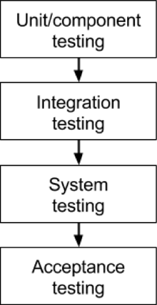
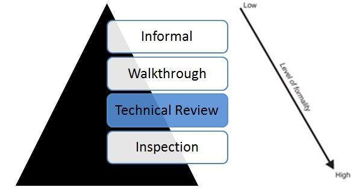

# Test Exam Notes

## Overview
- [Static analysis](#static)
- [Test levels](#levels)
- [Non coding test](#nocode)
- [Test activities](#activites)
- [Code quality](#quality)
- [Maintainable code](#maintainable)
- [Unit test](#unit)
- [Test driven development](#tdd)
- [Test doubles](#doubles)
- [Software quality](#qaulitysw)
- [Dependencies](#dependencies)
- [Test automation](#ci)
- [Specification-based testing](#specification)

## Static analysis
[Static analysis](https://www.youtube.com/watch?v=d_BCGvXbpKs) can on a broad spectrum be described as something that helps you maintain a healthy codebase without actually running any code. Most IDEs come with built in linters, or have plugin available to them, which makes it easy to install and utilize linters for a specific framework. Furthermore, many linters can be run via the CLI, making them easily extendable and shareable.

### Linting
Linting comes with a subset of categories, here amongst syntax and structured linting. Linting is essentially checking the code if specific rules are complied with, as well as spelling of certain keywords in a given contex. Furthermore linting can assist with setting the standard for how the code should be formulated, ensuring the quality and readability of the code. However this all comes down to the lint settings and linter the individual person is using.

## Test levels
Several testing levels can be defined and they each serve their own purpose.

Test levels can be illustrated the following way:

Mnay of these levels can be directly related to the V-Model

### Unit testing
Unit testing is the lowest level of testing, where a single "unit" is tested. This is to ensure the unit works on its own. Unit testing is done by developers.

The good unit test is:
- Indenpendent
- Repeatable

### [Intergration testing](https://www.youtube.com/watch?v=QYCaaNz8emY&list=PLDC2A0C8D2EC934C7&index=6)
In this phase of testing, individual units are combined and tested as a group. Data transfer between the modules is tested thoroughly. Intergration testing is done by testers.

#### Intergration test methods
- Big bang test; Wait untill all intertwained modules are ready
- Incremental testing; Test as modules becomes available

- Top down approach; Requires stubs - develop higher level modules first.
- Bottom up approach; Requries drivers - develop lower level modules first.

### [System testing](https://www.youtube.com/watch?v=N8-qNMHOVyw&list=PLDC2A0C8D2EC934C7&index=5)
System testing is concerned with the behavioor of the system as a whole, unlike intergration testing, which focuses on data transfer between units. System testing checks complete end to end scenarios, as the consumer would use the system.

### Acceptance testing
Acceptance test is usually done at client location by the client. The focus on acceptance test is not to find system defects, but rather to see if the software meets their requirements.

#### Alpha testing
- A small set of employees test the software

#### Beta testing
- A small set of customers test the software

## Non coding test

### [Reviews](https://www.tutorialspoint.com/software_testing_dictionary/review.htm) 
>A review is a systematic examination of a document by one or more people with the main aim of finding and removing errors early in the software development life cycle. Reviews are used to verify documents such as requirements, system designs, code, test plans and test cases.
Reviews are usually performed manually while static analysis of the tools is performed using tools.

### [Technical reviews](https://www.tutorialspoint.com/software_testing_dictionary/technical_review.htm)
>A Technical review is a static white-box testing technique which is conducted to spot the defects early in the life cycle that cannot be detected by black box testing techniques.

### [Management reviews](https://en.wikipedia.org/wiki/Software_management_review)
- Administrtive meassures
- Is the project on time
- Decrease/increase scope
- Is the project within budget?

### Audit
External personnel that verifies requirements and other compliances are complied with.

### Static analysis

### Linters

## Test activities

### Unit and Intergration testing
Relate to V-Model

### Refactoring
Functionality remains the same, but code becomes more readable and/or maintainable.

### Maintenance
Analyze where the code is weak, continue to refactor code or replace code with new and optimnized modules.

### Continous integration
CI ensure that all of the above points are up to the standards set by the team. It essentially wraps all the points together

### Code reviews
- Pair programming has been used extensively and is the fastest feedback loop in terms of code review.
- Colleagues or superiors reviewing the code that has been written.

## Code quality
Code quality can meassured in several different ways. The development team most likely has a coding standard, so the initial check would be to see if the coding standard has been followed. Next would be to make sure the teams linter is satisfied, and the two things can often be one and the same. High quality code should be testable, which means their headers, and return values are well thought out.

### Testable code
Testable code come in m any shapes and forms:
- Method has a return value
- Method has no dependcies instanciated, they are injected instead

### Names of test
Depends on the team, and what they've agreed on, but good practices would be something along the lines of:
>method-name_test-condition_expected-result // isOfAge_GreaterThanEighteen_ExpectedTrue

### Sufficient tests of a method
Depends on the ciritiallity of the method/class. If it's core functionallity, one test too many is great, if the method/class doesn't have an effect on the greater system, edge cases and core func of method is sufficient to test. However this is all subject to personal oponion and agreement in the team.

### [Defensive programming](https://datsoftlyngby.github.io/soft2020spring/TST/#51-questions)
>Defensive programming is a form of defensive design intended to ensure the continuing function of a piece of software under unforeseen circumstances. Defensive programming practices are often used where high availability, safety, or security is needed.

Defensive programming is an approach to improve software and source code, in terms of:

General quality – reducing the number of software bugs and problems.
Making the source code comprehensible – the source code should be readable and understandable so it is approved in a code audit.
Making the software behave in a predictable manner despite unexpected inputs or user actions.
Overly defensive programming, however, may safeguard against errors that will never be encountered, thus incurring run-time and maintenance costs. There is also a risk that code traps prevent too many exceptions, potentially resulting in unnoticed, incorrect results.

### Dependency injection
Dependency injection is moving responsibility out of a class or method, this can be achieved by giving the dependencies via the paramaters.

## Maintainable code

### Matainability
Relate to [SOLID principles](https://en.wikipedia.org/wiki/SOLID)
- [Single-responsibility principle](https://en.wikipedia.org/wiki/Single-responsibility_principle)
- [Open–closed principle](https://en.wikipedia.org/wiki/Open%E2%80%93closed_principle)
- [Liskov substitution principle](https://en.wikipedia.org/wiki/Liskov_substitution_principle)
- [Interface segregation principle](https://en.wikipedia.org/wiki/Interface_segregation_principle)
- [Dependency inversion principle](https://en.wikipedia.org/wiki/Dependency_inversion_principle)

### Product quality

### Temporal coupling
>Temporal coupling is coupling that occurs when there are two or more members of a class that need to be invoked in a particular order.

### Continous integration

### Static analysis

### Dependcy injection, [inversion of control](https://en.wikipedia.org/wiki/Inversion_of_control)

>Inversion of control serves the following design purposes:
>- To decouple the execution of a task from implementation.
>- To focus a module on the task it is designed for.
>- To free modules from assumptions about how other systems do what they do and instead rely on contracts.
>- To prevent side effects when replacing a module.

### Low coupling, high cohesion

### [Cyclomatic code complexity](https://en.wikipedia.org/wiki/Cyclomatic_complexity)
>Cyclomatic complexity is a software metric used to indicate the complexity of a program. It is a quantitative measure of the number of linearly independent paths through a program's source code.

## Unit testing
Unit test is the lowest level of functional testing. Unit test should cover a single unit or functionality. Looking at a bank project, check ballance would be a unit test, if the class or function itself is responsible for returning this output. Given a user would have to be authenticated to check their account, login with correct credentials would also be a suitable unit test, just like login with wrong credentials, which would be a negative test.

## Test driven development
Test driven development is the idea of coding test first. Which means that initially a new module is created by creating the test suitable for said module. The idea is that, if you've written the test, you've practically written the code, and it ensure testable code, as well as tests.

### Red, Green, Refactor
- Red — think about what you want to develop
- Green — think about how to make your tests pass
- Refactor — think about how to improve your existing implementation

## [Test doubles](https://en.wikipedia.org/wiki/Test_double)
>In computer programming and computer science, programmers and developers employ a technique called automated unit testing to enhance the quality of the software. Frequently, the final release software consists of a complex set of objects or procedures interacting together to create the final result. In automated unit testing, it may be necessary to use objects or procedures that look and behave like their release-intended counterparts, but are actually simplified versions that reduce the complexity and facilitate testing. A test double is a generic (meta) term used for these objects or procedures.

### Types of doubles
- Test stub (used for providing the tested code with "indirect input")
- Mock object (used for verifying "indirect output" of the tested code, by first defining the expectations before the tested code is executed)
- Test spy (used for verifying "indirect output" of the tested code, by asserting the expectations afterwards, without having defined the expectations before the tested code is executed. It helps in recording information about the indirect object created)
- Fake object (used as a simpler implementation, e.g. using an in-memory database in the tests instead of doing real database access)
- Dummy object (used when a parameter is needed for the tested method but without actually needing to use the parameter)

## Software quality 

## Dependencies

### Dependencies between layers

### System resources
All dependencies which can't easily be removed from the system, i.e I/O, disk, files network, system-clock etc.

### Relations between objects

### Dependency inversion, ioC, DI

### Mocks

## Test automation
Continious intergration and Continous Development is hot topics that continously run your unit test or a specified bunch of test everytime a push or pull is made from the repo. Again these things can be fiddled with in the settings, but generally speaking this is the idea.

### Regression
A new feature is added, which destroys already exsisting features. Regression testing is basically re-running tests. The art is realizing which tests are worth rerunning.

## Specification-based testing
It's acceptance testing.

### [Equivalence partitioning](https://en.wikipedia.org/wiki/Equivalence_partitioning)
> is a software testing technique that divides the input data of a software unit into partitions of equivalent data from which test cases can be derived

### [Boundary value analysis](https://en.wikipedia.org/wiki/Boundary-value_analysis)
>Boundary value analysis is a software testing technique in which tests are designed to include representatives of boundary values in a range.